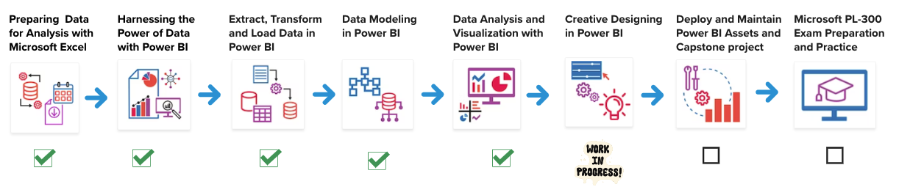
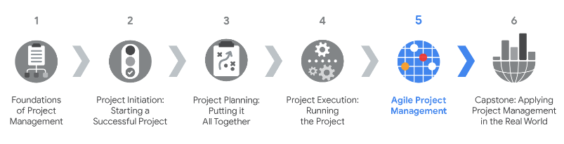

## Welcome to my GitHub. 👋

I am a passionate learner with a diverse range of interests and skills. Recently, I completed a Master of Science in Business Analytics - Data Analytics. I am actively seeking an environment that fosters continuous learning and professional development, where I can further apply my current skills and expand my knowledge.

Some of my interests are data science, psychology, languages, economics, and science. In my free time, I enjoy exercising, hiking, reading books, listening to podcasts, using Duolingo, watching Crash Course, reading The Economist, investing, and traveling. My favorite foods are passion fruit, coconut water, and chocolate. Trilingual (Spanish, English, and Portuguese).

## Recent projects

| Project                                                  | Description                                                                                                                      | Tools                                                                                                   | Date       |
|----------------------------------------------------------|----------------------------------------------------------------------------------------------------------------------------------|---------------------------------------------------------------------------------------------------------|------------|
| [Google Analytics Capstone Project for Fitbit Data (in RStudio)](https://github.com/angelhumano/google_analytics_cert_capstone) | Analyzed smart fitness device data for Bellabeat App's marketing strategy. | R, RStudio, R Notebook, and R Markdown | October 2023|

## Selected academic projects

| Project                                                  | Description                                                                                                                      | Tools                                                                                                   |
|----------------------------------------------------------|----------------------------------------------------------------------------------------------------------------------------------|---------------------------------------------------------------------------------------------------------|
| [Embarking on a United Nations data journey for migration insights](https://github.com/angelhumano/data_visualization_class_project) | Data Visualization Class: Analyzed global migration drivers, with a particular emphasis on World Development Indicators, and extracted valuable insights while creating impactful visualizations. | Colab, Python, and Tableau              |
| [Data Warehousing and Analytics](https://github.com/angelhumano/data_warehousing_analytics) | Performed ETL and data prep for a cloud-based BI data warehouse to uncover insights about vehicle collisions in NYC. | Lucidchart, Python, SQL, Colab, Google BigQuery, and Tableau|
| [Analyzing millions of NYC fire incident dispatch data](https://github.com/angelhumano/big_data_technologies_class_project1) | Big Data Technologies Class: Leveraged Big Data tools to handle a dataset exceeding a single machine's capacity to transform raw data into valuable insights.                     | EC2, Docker, Python, Terminal, Socrata Open Data API, OpenSearch, AWS Kibana|
| [Predicting and determining the factors that lead to employee attrition](https://github.com/angelhumano/data_mining_project) | Data Mining Class: Employed classification models (Logistic Regression, KNN, Decision Trees, Bagging, and Random Forest) to predict attrition and identify its key drivers. |R, RStudio, R Notebook, and R Markdown |

## Recent certifications
- [Google Data Analytics Specialization (Oct. 2023)](https://www.coursera.org/account/accomplishments/specialization/certificate/E8PXXFT6YDGW): Those who earn the Google Data Analytics Professional Certificate
have completed eight courses, developed by Google, that include
hands-on, practice-based assessments and are designed to prepare
them for introductory-level roles in Data Analytics. They are competent
in tools and platforms including spreadsheets, SQL, Tableau, and R.
They know how to prepare, process, analyze, and share data for
thoughtful action.
 

## Certifications in Progress

- [Extract, Transform and Load Data in Power BI (Jan. 2024)](https://www.coursera.org/account/accomplishments/certificate/H32SJZYXE3KP): Explored Extract, Transform, Load (ETL) processes, collected data from various sources, utilized Power Query for preparation, and analyzed data integrity in Power BI. The third course out of eight in the [Microsoft Power BI Data Analyst Professional Certificate](https://www.coursera.org/enroll/microsoft-power-bi-data-analyst/paidmedia?utm_medium=sem&utm_source=gg&utm_campaign=B2C_NAMER_microsoft-power-bi-data-analyst_microsoft_FTCOF_professional-certificates_country-US-country-CA&campaignid=20492962295&adgroupid=156381030121&device=c&keyword=microsoft%20power%20bi%20data%20analyst%20professional%20certificate&matchtype=b&network=g&devicemodel=&adposition=&creativeid=671291559808&hide_mobile_promo&gclid=Cj0KCQiApOyqBhDlARIsAGfnyMpswJSoVaMAluyKUremmUtD63_uYCHdgGhhUDyS8J_cSiTP1HQA6DAaAozPEALw_wcB).

  
   

  
- [From Likes to Leads: Interact with Customers Online (Jan. 2024)](https://www.coursera.org/account/accomplishments/certificate/Q42ZEB6EC7YM): Learned how to create marketing content and ads on social media platforms and evaluate their effectiveness using social media analytics data. The fourth course out of seven in the [Digital Marketing & E-commerce Certificate](https://grow.google/certificates/digital-marketing-ecommerce/?utm_source=gDigital&utm_medium=paidha-eng&utm_campaign=sem-sk-dm-exa-glp-br&utm_term=foundations%20of%20digital%20marketing%20and%20e%20commerce&gad=1&gclid=Cj0KCQiAr8eqBhD3ARIsAIe-buOIigN25AQThbNLImEUS8APpcD_t_NwCMD-p8RthWW1LQFR5XVts60aAkMcEALw_wcB#?modal_active=none).
  

  

- [Foundations of Project Management (Jan. 2024)](https://www.coursera.org/account/accomplishments/certificate/7VLQZGDJAL7R): Learned about project management skills, core concepts, methodologies, and project management roles. The second course out of six in the [Google Project Management Certificate](https://grow.google/certificates/project-management/#?modal_active=none).

  
 

## References

- [GitHub Readme Stats](https://github.com/anuraghazra/github-readme-stats): Dynamically generated stats for your github readmes by Anurag Hazra.

  
Do not click this arrow

    
   
  “Education is the kindling of a flame, not the filling of a vessel.” ― Socrates
  
  “You can develop skills and experience, but it is hard to develop character.”

  “If I have seen further it is by standing on the shoulders of Giants.” ― Isaac Newton

  “In the fixed mindset, everything is about the outcome. If you fail—or if you’re not the best—it’s all been wasted. The growth mindset allows people to value what they’re doing regardless of the outcome . They’re tackling problems, charting new courses, working on important issues. Maybe they haven’t found the cure for cancer, but the search was deeply meaningful.” ― Carol S. Dweck, Mindset: The New Psychology of Success
  
  **Have a wonderful day** :grin:

